<div align="center">  

# Preguntas de JavaScript

</div>

##### [Crédito: Idea original](https://rb.gy/1xtk4)

## Índice
1. [Comportamiento de variables `var` y `let` en JavaScript: Ejemplo de
   "hoisting" y "zona muerta temporal".](https://shorturl.at/inFPX)
2. [Alcance de variables y setTimeout en JavaScript.](https://bit.ly/3rJQqIa)
3. [Funciones regulares y flecha con el uso del this en JavaScript.
   ](https://bit.ly/3KhodyP)
4. [Conversiones booleanas y evaluación de expresiones en JavaScript.
   ](https://bit.ly/3Kh0XRI)
5. [Acceso a propiedades de objetos en JavaScript: Notación de corchetes y
   notación de puntos](https://shorturl.at/sJOT8)
6. [Manejo de objetos por referencia en JavaScript](https://bit.ly/3QeGtMY)
7. [Comparación entre operadores == y === en JavaScript: Valor vs. Valor y Tipo
   ](https://bit.ly/3q5jmd6)
8. [TypeError: Acceso incorrecto al método estático en una instanciaespecífica
   ](https://shorturl.at/tx369)
9. [Depuración de errores y el uso estricto en JavaScript
   ](https://shorturl.at/aqC15)
10. [Las funciones en JavaScript: objetos invocables](https://shorturl.at/dgw56)
11. [Optimización de memoria en JavaScript mediante el uso de prototipos
    ](https://shorturl.at/cimR9)
12. [Creación de instancias: Uso de 'new' vs. in 'new': Impacto en la asignación
    de propiedades](https://bit.ly/3DwUiij)
13. [Fases de propagación de eventos en la programación de la interfaz de
    usuario](https://bit.ly/456Ghnp)
14. [Herencia de prototipos y acceso a métodos en JavaScript
    ](https://rebrand.ly/k0snynl)
15. [Tipado dinámico y coerción implícita de tipos](https://rebrand.ly/sysug0c)
16. [Operadores unarios de incremento y sus resultados.
    ](https://shorturl.at/quzR8)
17. [Plantillas etiquetadas en JavaScript: Personaliza y modifica las salidas de
    las plantillas literales](https://shorturl.at/dimxW)
18. [Comparación de objetos en JavaScript](https://bit.ly/43Jq2LF)
19. [El operador de propagación (spread operator) en
    JavaScript"](https://rebrand.ly/rwnsrwu)
20. [La importancia de utilizar 'use strict' para evitar variables globales
    accidentales](https://shorturl.at/kmGIT)
21. [Evaluación de una cadena: el uso de eval()](https://shorturl.at/ghmxY)
22. [Persistencia de datos: Impacto al cerrar la pestaña o el navegador.
    ](https://shorturl.at/dFHIY)
23. [Diferencias de alcance entre `var`, `let` y `const` en JavaScript
    ](https://rb.gy/5fpee)
24. [Diferencias en el manejo de claves entre objeto y conjuntos
    ](https://rb.gy/tygcp)
25. [Sustitución de claves en objetos: un ejemplo de actualización de valores en
    duplicados](https://shorturl.at/wDSUX)
26. [El contexto de ejecución en JavaScript: Creación el objeto global y la
    palabra reservada "this"](https://shorturl.at/xRTWX)
27. ["La palabra reservada `continue` en JavaScript: Omitiendo iteraciones con
    condiciones específicas"](https://shorturl.at/pEQRS)
28. [Ampliando funcionalidades: Añadiendo un método al prototipo del constructor
    String](https://rb.gy/zbj46)
29. [La conversión automática de claves en objetos y el misterio de '[object
    Object]'](https://shorturl.at/hvxQX)
30. [Event Loop: Función SetTimeout](https://shorturl.at/wzBJ4)
31. [Valores falsos](https://shorturl.at/sLTW9)
32. [Palabra reservada typeof](https://shorturl.at/iopBW)
33. [Explorando los Arreglos en JavaScript: Ranuras Vacías y Valores `undefined`
    ](https://shorturl.at/kyKU1)
34. [Técnica de Reducción en JavaScript: Concatenando Arrays en un Solo Valor
    ](https://shorturl.at/gmsuE)
35. [Lógica de Negación y Valores Booleanos](https://shorturl.at/adrBQ)
36. [Sintaxis Extendida o Spread Syntax](https://shorturl.at/BLTX6)
37. [Interacción por referencia en JavaScript: Cómo afecta a los objetos dentro
    de un array](https://shorturl.at/dlTV0)
38. [Asociatividad de operadores](https://shorturl.at/abES7)
39. [El método parseInt()](https://shorturl.at/alqJQ)
40. [JSON.stringify: Serialización de Objetos en Formato JSON
](https://shorturl.at/jop05)
41. [Importaciones y Modificaciones de Variables en Módulos JavaScript
](https://shorturl.at/ADIUY)
42. [Uso del Operador 'Delete' en JavaScript: Eliminación de Propiedades y
Variables](https://shorturl.at/qEOT9)
43. [Desestructuración en JavaScript: Extracción de Valores de Arrays y
    Objetos](https://shorturl.at/uzADU)
44. [Operadores Unarios en JavaScript](https://shorturl.at/mqzX6)
45. [Inicialización de Parámetros y Valores Predeterminados en
    ES6](https://shorturl.at/FKQX4)
46. [Distinguiendo la Unicidad y Equivalencia de Symbols en JavaScript
](https://shorturl.at/xBGP9)
47. [Método padStart en JavaScript para Manipular Cadenas de Texto
](https://shorturl.at/dsAQY)
48. [Entendiendo el Comportamiento de la Función push() en JavaScript
](https://shorturl.at/ewFMO)

---

<!-- 1 a 10 -->
# 1. ¿Qué devuelve la función saluda? 
###### [ÍNDICE](https://bit.ly/44AIBmF)
<!-- El link del índice pensado para ser clickeado desde el navegador -->

```javascript
function saluda(){
   console.log(nombre)
   console.log(edad)
var nombre = "Franco"
let edad = 27
}
```
- A: `ReferenceError` y `27`
- B: `undefined` y `ReferenceError`
- C: `Franco` y `undefined`
- D: `Franco` y `ReferenceError`
  
<div align="center">

<details><summary><b>RESPUESTA</b></summary>
<p>
   
## La correcta es la `B`.

<div align="left">

1. Para las variables declaradas con `var`, durante la fase de creación del 
contexto de ejecución, se reserva un espacio en memoria y se asigna el valor 
predeterminado `undefined`. Esto se conoce como 
"[hoisting](https://developer.mozilla.org/es/docs/Glossary/Hoisting)" o 
elevación. En el ejemplo, la variable "nombre" se declara con `var`, por lo que 
se eleva y se inicializa con el valor `undefined` antes de que se alcance la 
línea de código donde se define.
2. Sin embargo, las variables declaradas con `let` o `const` también se elevan,
pero no se inicializan. Éstas tienen una "[zona muerta
temporal](https://wesbos.com/temporal-dead-zone)" en la que no son accesibles
antes de la línea de código en la que se declaran (se inicializan). Si
intentamos acceder a una variable `let` o `const` antes de su declaración, se
lanzará un `ReferenceError` . En el ejemplo, la variable `edad` de declara con
`let`, y como intentamos acceder a ella antes de su declaración, se produce un
`ReferenceError`.

</div>

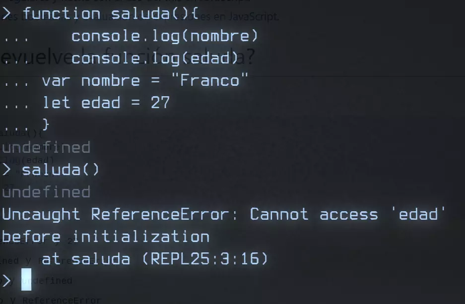


</p>
</details>

</div>

---

# 2. ¿Qué devuelve esta serie de bucles?
###### [ÍNDICE](https://bit.ly/44AIBmF)

```javascript
for (var i = 5; i < 8; i++){
  setTimeout(() => console.log(i), 1);
}

for(let i = 5; i < 8; i++){
  setTimeout(() => console.log(i), 1);
}
```
- A: `5 6 7`  y  `5 6 7`
- B: `5 6 7`  y  `7 7 7`
- C: `7 7 7`  y  `5 6 7`


<div align="center">
<details><summary><b>RESPUESTA</b></summary>
<p>

## La correcta es la `C`.

<div align="left">

En JavaScript, las funciones
[`setTimeout`](https://developer.mozilla.org/es/docs/Web/API/setTimeout) se
ejecutan de forma asíncrona. Esto significa que se colocan en la cola de eventos
y se ejecutan después de que se hayan completado todas las tareas sincrónicas.

En el primer bucle, se utiliza la palabra reservada `var` para declarar la 
variable `i`. Al usar `var`, el alcance de la variable se vuelve global. Esto 
significa que todas las iteraciones del bucle comparten la misma variable `i`. 
Durante cada iteración, el valor de `i` se incrementa en 1. Sin embargo, debido 
a que las funciones `setTimeout` se ejecutan de forma asíncrona 
después de que el bucle haya terminado, todas las funciones `setTimeout` ven el 
mismo valor de `i`, que es 3 al final del bucle. Por lo tanto, cuando se 
ejecutan las funciones `setTimeout`, todas imprimen el valor 3.

En el segundo bucle, se utiliza la palabra reservada `let` para declarar la 
variable `i`. Al usar `let`, se crea una nueva variable `i` en cada iteración 
del bucle. Cada variable `i` tiene su propio alcance de bloque y se conserva 
dentro del bloque del bucle. Cuando se llama a la función `setTimeout` en cada 
iteración, se captura el valor actual de `i` dentro de ese alcance de bloque 
específico. Como resultado, cada función `setTimeout` ve un valor de `i` 
distinto correspondiente a su respectiva iteración del bucle.

En resumen, la diferencia en el comportamiento se debe al alcance de las 
variables `i`. Con `var`, se comparte una sola variable `i` en todo el bucle,
lo que provoca que todas las funciones `setTimeout` vean el mismo valor al 
final del bucle. Con `let`, se crea una nueva variable `i` en cada iteración del 
bucle, lo que permite que cada función `setTimeout` capture el valor 
correspondiente a su propia iteración.

</div>

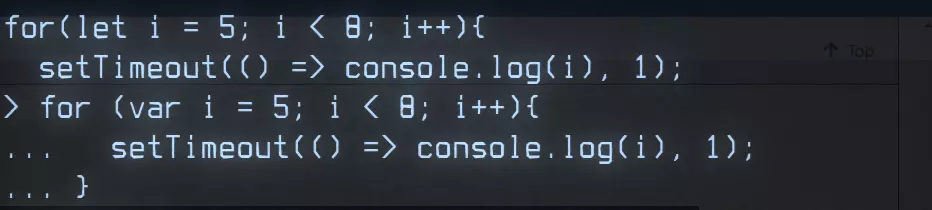


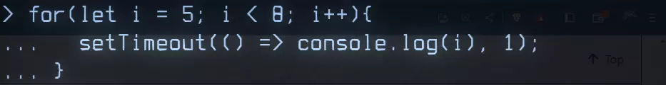


</p>
</details>
</div>

---

# 3. ¿Qué imprimirían estos console.log( ) ?
###### [ÍNDICE](https://bit.ly/44AIBmF)

```javascript
const forma = {
  radio: 10,
  diametro(){
    return this.radio * 2;
  },
  perimetro: () => 2 * Math.PI * this.radio,
};

console.log(forma.diametro());
console.log(forma.perimetro());
``` 
- A: `20` y `62.83185307179586`
- B: `20` y `NaN`
- C: `20` y `63`
- D: `NaN` y `63`

<div align="center">
<details><summary><b>RESPUESTA</b></summary>
<p>

## La correcta es la `B`.

<div align="left">

Porque `forma.diametro()` es una función regular que accede 
correctamente a la propiedad `radio` del objeto `forma` utilizando la palabra 
clave `this`. Por lo tanto, al llamar a `console.log(forma.diametro())`, se 
imprimirá el valor de 20.

Por otro lado, `forma.perimetro` es una función flecha que hereda el ámbito 
circundante, que en este caso sería el ámbito global o del archivo. La palabra
clave `this` dentro de `perimetro` no se refiere al objeto `forma`, sino a su 
ámbito circundante. Dado que no hay una propiedad `radio` en el ámbito 
circundante, se devuelve `undefined`, y al realizar el cálculo, el resultado es 
NaN (Not a Number). Por lo tanto, al llamar a `console.log(forma.perimetro())`, 
se imprimirá NaN.

</div>

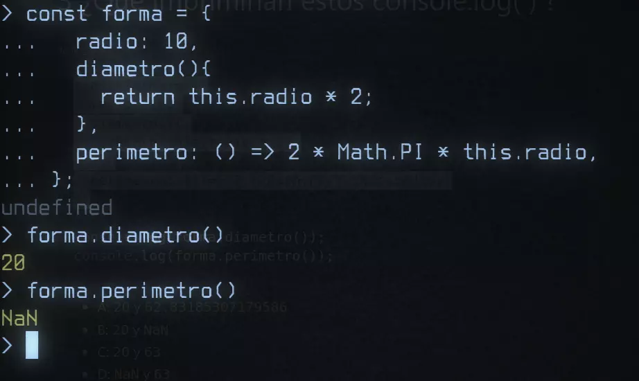

</p></details>
</div>

--- 

# 4. ¿Qué devolvería el siguiente código?
###### [ÍNDICE](https://bit.ly/44AIBmF)

```javascript
  +true;
  !"Franco";
```
- A: `1` y `false`
- B: `false` y `NaN`
- C: `false` y `false`

<div align="center">
<details><summary><b>RESPUESTA</b></summary> <p>

## La correcta es la `A`.

<div align="left">
En el primer caso `+true` se trata de convertir el valor booleano `true` en un 
número. Cuando se convierte un valor booleano a número, `true` se convierte en 1
y `false` se convierte en 0. Por lo tanto, `+true` devuelve el número 1.

En el segundo caso, `!"Franco"` es una expresión de negación lógica(`!`) que se 
aplica a la cadena de texto "Franco". En JavaScript, cualquier cadena de texto 
vacía se considera verdadera en un contexto booleano. Al negarla, estamos 
preguntando si este valor verdader es falso. Por lo tanto, `!"Franco"` devuelve
el valor booleano false.
</div>
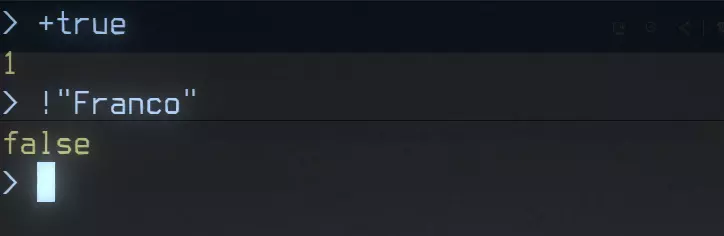

</p></details>
</div>

---

# 5. ¿Cuál de éstas opciones es incorrecta?
###### [ÍNDICE](https://bit.ly/44AIBmF)

```javascript
  const pajarito = {
    tamanio : "pequenio"
  };

  const raton = {
    nombre : "Perez",
    pequenio : true
  };
```
- A: `raton.pajarito.tamanio`
- B: `raton[pajarito.tamanio]`
- C: `raton[pajarito["tamanio"]]`

<div align="center">
<details><summary><b>RESPUESTA</b></summary> <p>

## La incorrecta sería la A.

<div align="left">

En JavaScript, todas las claves de un objeto se interpretan como
[`cadenas`](https://shorturl.at/csLO4) , a menos que sean de tipo "símbolo".
Aunque no las escribamos explícitamente como cadenas, se comportan internombrente
como cadenas.

Cuando utilizamos la [`notación de corchetes`](https://shorturl.at/ikuR1) para
acceder a las propiedades de un objeto, JavaScript interpreta la declaración.
Comienza evaluando lo que está dentro de los corchetes, desde el corchete de
apertura `"["` hasta el corchete de cierre `"]"`. Solo de esta manera se
evaluará correctamente la expersión.

Por ejemplo, en el caso de `raton[pajarito.tamanio]`, primero se evalúa 
`pajarito.tamanio`, que tiene un valor de "pequenio". Luego, JavaScript 
interpreta `raton["pequenio"]`, lo cual devuelve `true`.

Sin embargo, con la [`notación de puntos`](https://shorturl.at/bxCEX), esto no
ocurre de la misma manera. Si intentamos acceder a una propiedad utilizando la
notación de puntos, como `raton.pajarito.tamanio`, JavaScript busca una
propiedad llamada `"pajarito"` dentro del objeto `raton`. Como `raton.pajarito`
es `undefined`, en realidad estamos intentando acceder a `undefined.tamanio`.
Esto no es válido y generará un error similar a "Cannot read property
`'tamanio'` of undefined".

</div>

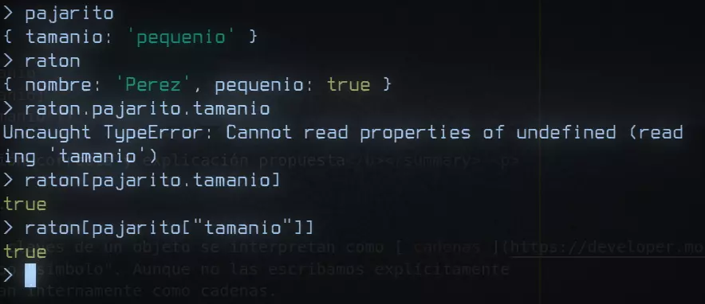

</p></details>
</div>

---

# 6. ¿Qué devuelve este código?
###### [ÍNDICE](https://bit.ly/44AIBmF)

```javascript
  let a = { saludo: "¿Qué tal?" };
  let b;

  b = a;
  a.saludo = "¡Hola!";
  console.log(b.saludo);
```
- A: `¡Hola!`
- B: `undefined`
- C: `ReferenceError`
- D: `TypeError`

<div align="center">
<details><summary><b>RESPUESTA</b></summary> <p>

## La correcta es la `A`.

<div align="center">

En `JavaScript`, los objetos se manejan por referencia. Cuando se asignan a 
variables o se pasan como argumentos a funciones, todos apuntan a la misma 
ubicación en memoria. Por lo tanto, cuando se cambia un objeto, ésto se verá 
reflejado en todas las otras referencias que apunten a ese objeto.

Primero se crea un objeto `a` con un valor determinado. Se asigna la referencia
`a` a la variable `b`, es por eso que ambas variables apuntan al mismo objeto en 
la memoria.

Cuando se modifica el objeto a través de la variable `a`, el cambio se refleja 
también en la variable `b` porque ambas apuntan al mismo objeto.

En `JavaScript`, cuando se cambia un objeto, todos los objetos que compartan la 
misma referencia se verán afectados por ese cambio.

</div>

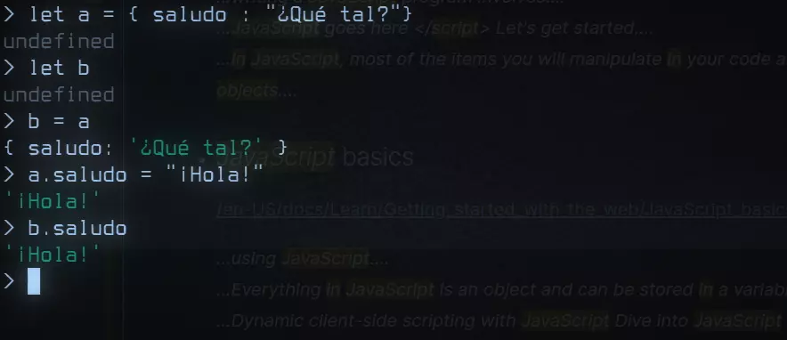

</p></details>
</div>

---

# 7. ¿Qué imprimirían estos console.log( )?
###### [ÍNDICE](https://bit.ly/44AIBmF)

```javascript
  let a = 3;
  let b = new Number(3);
  let c = 3;

  console.log(a == b);
  console.log(a === b);
  console.log(b === c);

```
- A. `true` `false` `true`
- B. `false` `false` `true`
- C. `true` `false` `false`
- D. `false` `true` `true`

<div align="center">
<details><summary><b>RESPUESTA</b></summary> <p>

## La correcta es la `C`.

<div align="left">

"`new Number( )`" es un constructor de funciones integrado en JavaScript. 
Aunque parece representar un número, en realidad es un objeto con 
características adicionales.

Cuando utilizamos el operador `"=="`, se verifica si dos valores son iguales, 
sin tener en cuenta el tipo de  dato. En este caso, ambos tienen el valor de 3, 
por lo que se devuelve `"true"`.

sin embargo, cuando utilizamos el operador `"==="`, se verifica tanto el valor 
como el tipo de dato. Dado que "`new Number( )`" no es un número, sino un objeto
, los dos valores no son iguales y se devuelve `"false"`.

</div>

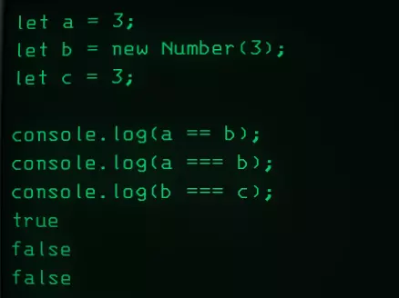

</p></details>
</div>

---

# 8. ¿Qué devolvería este código?
###### [ÍNDICE](https://bit.ly/44AIBmF)

```javascript
  class camaleon  {
    static cambiarColor (colorNuevo){
      this.color = colorNuevo;
      return this.color;
    }

    constructor({color = "verde"} = {}){
      this.color = color;
    }
  }
  const manchita = new camaleon({color : "azul"});
  manchita.cambiarColor("naranja");

```
- A. `verde`
- B. `naranja`
- C. `azul`
- D. `TypeError`

<div align="center">
<details><summary><b>RESPUESTA</b></summary> <p>

## La correcta es la `D`.

<div align="left">

El método cambiarColor es estático y no se puede acceder a través de una 
instancia como `manchita.cambiarColor("naranja")`. Debería ser llamado 
directamente en la clase camaleon, como `camaleon.cambiarColor("naranja")`. 
Esto causa un TypeError.

</div>

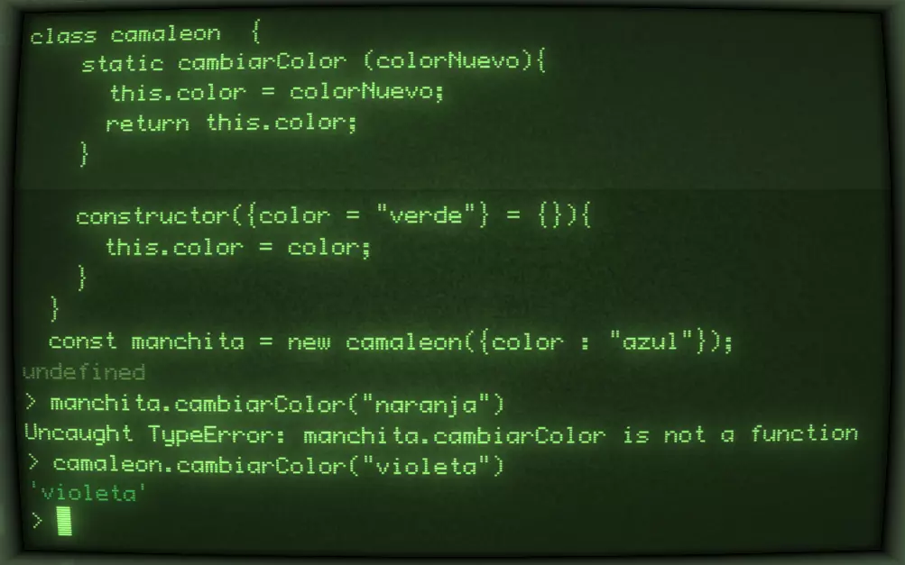

</p></details>
</div>

---

# 9. ¿Qué imprimiría este console.log( )?
###### [ÍNDICE](https://bit.ly/44AIBmF)

```javascript
 let saludo;
 asludo = {}; // Error de tipeo
 console.log(asludo);

```
- A. `{}`
- B. `ReferenceError: asludo is not defined`
- C. `undefined`

<div align="center">
<details><summary><b>RESPUESTA</b></summary> <p>

## La correcta es la `A`.

<div align="left">

En este caso, JavaScript registra el objeto porque acabamos de crear un objeto 
vacío en el objeto global. Cuando escribimos erróneamente `saludo` como `asludo`
, el intérprete de JavaScript lo interpreta como `global.asludo = {}`
(o window.asludo = {} en un navegador).

Para evitar este tipo de errores, podemos utilizar el `"modo estricto"` (["use
strict"](https://shorturl.at/hqP03)). Esto garantiza que una variable se declare
antes de asignarle cualquier valor.

</div>

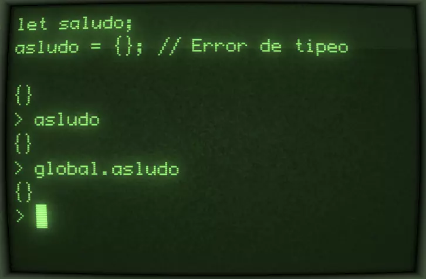
  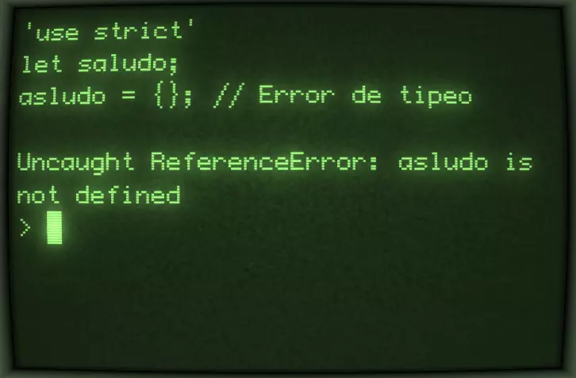

</p></details>
</div>

---

# 10. ¿Qué sucede en este caso?
###### [ÍNDICE](https://bit.ly/44AIBmF)

```javascript
 function ladrar( ){
  console.log("Guau!");
 }
 
 ladrar.animal = "perro";

```
- A. No pasa nada, es válido
- B. `SyntaxError`. No es posible agregar propiedades a una función así.
- C. `undefined`
- D. `ReferenceError`

<div align="center">
<details><summary><b>RESPUESTA</b></summary> <p>

## La correcta es la `A`.

<div align="left">

En JavaScript las funciones son `objetos`.(Excepto los tipos primitivos, `todo` 
es un objeto en JavaScript).

Una función se considera un objeto. El código que escribas no es en realidad la 
función en sí, sino que la función es un objeto que posee propiedades. Una de 
esas propiedades es la capacidad de ser invocada.

</div>

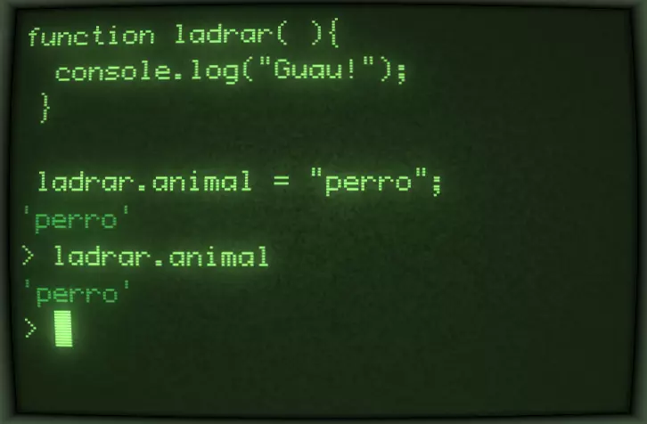

</p></details>
</div>

---
<!-- 10 a 20 -->
# 11. ¿Qué devuelve esta función?
###### [ÍNDICE](https://bit.ly/44AIBmF)

```javascript
function Persona(nombre, apellido){
  this.nombre = nombre;
  this.apellido = apellido;
}

const asociado = new Persona("Franco", "Ibañez");

Persona.obtenerNombreCompleto = function(){
  return `${this.nombre} ${this.apellido}`;
}

console.log(asociado.obtenerNombreCompleto());

```
- A. `TypeError`
- B. `SyntaxError`
- C. `Franco Ibañez`
- D. `undefined` `undefined`

<div align="center">
<details><summary><b>RESPUESTA</b></summary> <p>

## La correcta es la `A`.

<div align="left">

En JavaScript, no es posible añadir propiedades a un constructor como se hace 
con los objetos. Para agregar una característica a todos los objetos al mismo 
tiempo, se debe utilizar el prototipo en su lugar. 
Se debería haber hecho algo así:
```javascript
Persona.prototype.obtenerNombreCompleto = function(){
  return `${this.nombre} ${this.apellido}`
}
```
de esta forma, "asociado.obtenerNombreCompleto" hubiese funcionado 
correctamente.

La ventaja de utilizar el prototipo radica en la optimización del uso de memoria
. Si se agregara este método directamente al constructor, todas las instancias
de "Persona" tendrían esta propiedad, lo que consumiría más memoria. Sin embargo
, al añadirlo al prototipo, solo se guarda una copia en la memoria y todas las 
instancias pueden acceder a él. Esto evita el desperdicio innecesario de espacio 
de espacio en memoria.

</div>

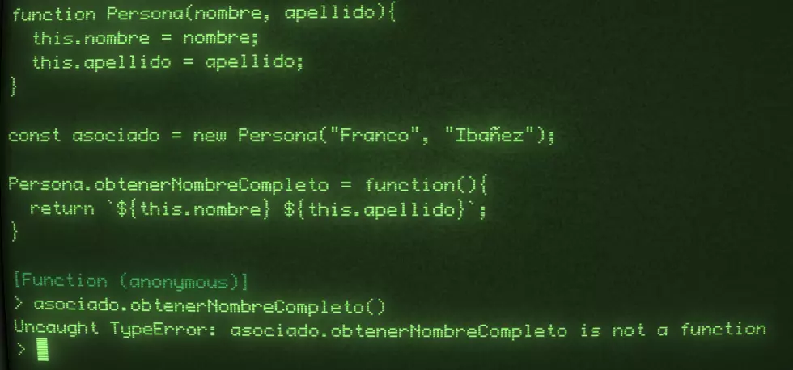
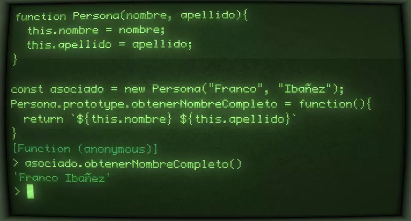

</p></details>
</div>

---

# 12. ¿Qué devuelve esta función?
###### [ÍNDICE](https://bit.ly/44AIBmF)

```javascript
function Persona(nombre, apellido){
  this.nombre = nombre;
  this.apellido = apellido;
}

const franco = new Persona("Franco", "Ibañez");
const juan = Persona("Juan", "Sabato");

console.log(franco);
console.log(sarah);

```
- A: `Persona {nombre: "Franco", apellido: "Ibañez"}` y `undefined`
- B: `Persona {nombre: "Franco", apellido: "Ibañez"}` 
      y `Persona {nombre: "Juan", apellido: "Sabato"}`
- C: `Persona {nombre: "Franco", apellido: "Ibañez"}` y `{}`
- D: `Persona {nombre: "Franco", apellido: "Ibañez"}` y `ReferenceError`

<div align="center">
<details><summary><b>RESPUESTA</b></summary> <p>

## La correcta es la `A`.

<div align="left">

Cuando se crean las 2 instancias de la clase Persona, la instancia `franco` se 
crea utilizando la palabra reservada `new`, lo que significa que se crea un 
nuevo objeto vacío y se asigna a `this` dentro la función `Persona`.

Al crear la instancia `juan`, no se utiliza la palabra reservada `this`. Dentro
de la función Persona, el `this` se refiere al objeto global en lugar de crear 
un nuevo objeto. Las propiedades `nombre` y `apellido` se asignan al objeto 
global en lugar de a un nuevo objeto.
</div>

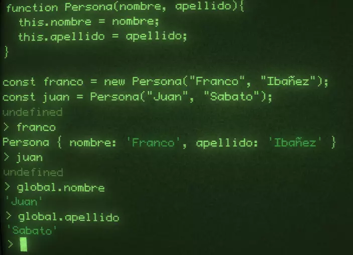

</p></details>
</div>

---

# 13. ¿Cuáles son las 3 fases de la propagación de eventos?
###### [ÍNDICE](https://bit.ly/44AIBmF)


- A: `Target` > `Capturing` > `Bubbling`
- B: `Bubbling` > `Target` > `Capturing`
- C: `Target` > `Bubbling` > `Capturing`
- D: `Capturing` > `Target` > `Bubbling`

<div align="center">
<details><summary><b>RESPUESTA</b></summary> <p>

## La correcta es la `D`.

<div align="left">

Estas fases son importantes en la programación de eventos en el ámbito de la 
interfaz de usuario y se refieren al orden en que los eventos se propagan a 
través de los elementos del DOM (Modelo de Objetos del Documento).

La respuesta correcta es D: Capturing > Target > Bubbling. Esto significa que el
evento primero pasa por la fase de Capturing, luego alcanza el elemento objetivo
(Target) y finalmente se propaga en la fase de Bubbling.

Durante la fase de Capturing, el evento se propaga desde el elemento raíz del 
DOM hacia el elemento objetivo. A medida que se propaga, atraviesa los elementos
ancestros en el camino hacia el elemento objetivo.

Una vez que el evento alcanza el elemento objetivo, comienza la fase de 
Bubbling. En esta fase, el evento se propaga desde el elemento objetivo hacia el
elemento raíz del DOM. Al igual que en la fase de Capturing, atraviesa los 
elementos ancestros en su camino hacia el elemento raíz.

Es importante comprender estas fases de propagación de eventos para manejar 
adecuadamente los eventos en la programación de la interfaz de usuario. 
Dependiendo del caso de uso, se puede aprovechar la fase de Capturing o la fase 
de Bubbling para capturar o manejar eventos en elementos específicos del DOM.

</div>


</p></details>
 </div>

---

# 14. Todos los objetos tienen un prototipo.
###### [ÍNDICE](https://bit.ly/44AIBmF)


- A: `Verdadero`
- B: `Falso`

<div align="center">
<details><summary><b>RESPUESTA</b></summary> <p>

## La correcta es la `B`.

<div align="left">

En JavaScript, todos los objetos tienen un prototipo, excepto el [objeto base
](https://rebrand.ly/19h7y4k). El objeto base es el punto final de la cadena de
prototipos y no tiene ningún prototipo al que acceder. Esta es la razón por la
que el objeto base no tiene métodos o propiedades específicas disponibles para
su uso.

Sin embargo, cuando creamos objetos a partir de constructores o clases, esos 
objetos heredan el prototipo de su constructor o clase. El prototipo actúa como 
un "modelo" para los objetos y contiene métodos y propiedades compartidos que 
pueden ser utilizados por los objetos creados a partir de él.

Por ejemplo, el componente en cuestión tiene acceso a algunos métodos y 
propiedades, como el método `.toString()`. Esto se debe a que el objeto del 
componente hereda el prototipo que contiene ese método.

Cuando se accede a un método o propiedad en un objeto, JavaScript busca primero 
en el objeto en sí. Si no se encuentra allí, continúa buscando en la cadena de 
prototipos del objeto hasta encontrarlo. Esto se conoce como herencia de 
prototipos.

Entonces, aunque no podemos encontrar directamente un método o propiedad en un 
objeto, JavaScript desciende por la cadena de prototipos y lo encuentra allí, lo
que lo hace accesible para su uso posterior.

Este mecanismo de herencia de prototipos en JavaScript permite el uso de los 
métodos y propiedades incorporados del lenguaje, ya que están disponibles en los
prototipos de los objetos. 

</div>

</p></details>
</div>

---

# 15. ¿Qué devuelve esta función?
###### [ÍNDICE](https://bit.ly/44AIBmF)

```javascript
function sumar(a,b){
  return a + b;
}

sumar(2, "5");

```
- A. `NaN`
- B. `7`
- C. `TypeError`
- D. `"25"`

<div align="center">
<details><summary><b>RESPUESTA</b></summary> <p>

## La correcta es la `D`.

<div align="left">

En JavaScript, no es necesario declarar explícitamente el tipo de una variable, 
ya que se determina automáticamente durante la ejecución del programa. Esto se 
debe a que JavaScript es un lenguaje de tipado dinámico o de tipado débil.

La [coerción implícita de
tipos](https://developer.mozilla.org/es/docs/Glossary/Type_coercion)
es un concepto en JavaScript donde los valores pueden convertirse 
automáticamente en otro tipo sin necesidad de ser declarado. 
Esto permite que los valores se ajusten y se utilicen de manera flexible en 
diferentes operaciones.

Un ejemplo de coerción implícita ocurre cuando se realiza una suma entre un 
número y una cadena. En este caso, JavaScript convierte el número en una cadena 
para que la operación tenga sentido y pueda devolver un resultado. Por ejemplo, 
al sumar el número 2 con la cadena "5", JavaScript trata al número como una 
cadena y realiza una concatenación de cadenas, resultando en el valor "25".

La coerción en JavaScript implica la conversión de un tipo de dato a otro de 
forma automática según el contexto de la operación o expresión. Esto 
proporciona flexibilidad en la manipulación de valores, pero también requiere 
cuidado al realizar operaciones para evitar resultados inesperados.

</div>

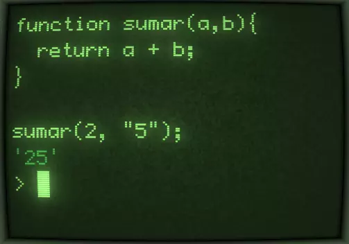

</p></details>
</div>

---

# 16. ¿Qué devuelve esta función?
###### [ÍNDICE](https://bit.ly/44AIBmF)

```javascript
let numero = 0;
console.log(numero++);
console.log(++numero);
console.log(numero);

```
- A. `1` `1` `1`
- B. `1` `2` `2`
- C. `0` `2` `2`
- D. `0` `1` `2`

<div align="center">
<details><summary><b>RESPUESTA</b></summary> <p>

## La correcta es la `C`.

<div align="left">

Aquí debemos tener en cuenta el comportamiento del operador unario ++ : <br>
Si lo aplicamos `postfix`...(algo++)
1. Devuelve el valor actual.
2. Incrementa el valor en 1.

Si lo aplicamos `prefix`...(++algo)
1. Incrementa el valor en 1
2. Devuelve el valor actual

</div>

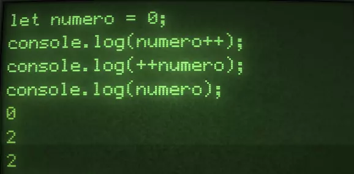

</p></details>
</div>

---

# 17. ¿Qué devuelve esta función?
###### [ÍNDICE](https://bit.ly/44AIBmF)

```javascript
function obtenerInfoPersona(uno, dos, tres){
  console.log(uno);
  console.log(dos);
  console.log(tres);
}
const persona = "Franco";
const edad = 27;

obtenerInfoPersona`${persona} tiene ${edad} años`

```
- A. `"Franco"` `27` `[""," tiene ", " años"]`
- B. `[""," tiene ", " años"]` `"Franco"` `27`
- C. `"Franco"` `[""," tiene ", " años"]` `27`

<div align="center">
<details><summary><b>RESPUESTA</b></summary> <p>

## La correcta es la `B`.

<div align="left">

Las [`plantillas etiquetadas`](https://rebrand.ly/3urlx7d) son una funcionalidad
avanzada de las `plantillas literales` en JavaScript. Al utilizar las plantillas
etiquetadas, podemos modificar la salida de las plantillas utilizando una
función personalizada (la `función etiquetada`). [Más
info](https://rebrand.ly/jcz707n)

Cuando se utiliza una `plantilla etiquetada`, la llamada se convierte en una 
invocación de función, donde la plantilla literal se pasa como argumento. El 
primer argumento de la función es siempre un array que contiene las cadenas de 
caracteres de la plantilla. Los argumentos restantes se asocian con las 
expresiones de la plantilla.

La `función etiquetada` puede realizar cualquier operación deseada con estos 
argumentos. Puede manipular las cadenas de la plantilla, combinarlas con los 
valores de las expresiones, realizar cálculos o cualquier otro procesamiento 
necesario. Luego la función devuelve la cadena final manipulada o puede incluso
un resultado completamente diferente, dependiendo de la lógica implementada 
dentro de la función.

Es importante destacar que el nombre de la función utilizada como etiqueta no 
tiene nada de especial, puede ser cualquier nombre de función válido 
en JavaScript.

</div>

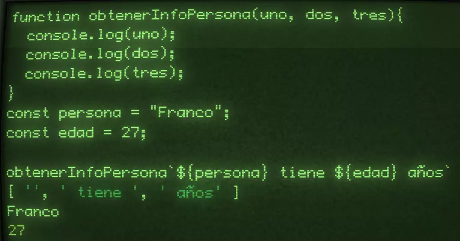

</p></details>
</div>

---

# 18. ¿Qué devuelve esta función?
###### [ÍNDICE](https://bit.ly/44AIBmF)

```javascript
function verificarEdad(data){
  if(data === {edad: 18}){
    console.log("¡Eres mayor de edad!");
  }else if(data == {edad: 18}){
    console.log("Aún eres mayor de edad.");
  }else{
    console.log("Hmm...Supongo que no tienes una edad.")
  }
}
verificarEdad({edad: 18});
```
- A. `¡Eres mayor de edad!`
- B. `Aún eres mayor de edad.`
- C. `Hmm...Sunpongo que no tienes una edad.`

<div align="center">
<details><summary><b>RESPUESTA</b></summary> <p>

## La correcta es la `C`.

<div align="left">

La función `verificarEdad` verifica la edad de una persona según los datos 
proporcionados. Al llamar a `verificarEdad({ edad: 18 })`, el resultado sería la 
opción C: `"Hmm..Sunpong que no tienes edad"`.

El código compara el parámetro data con objetos que contienen la propiedad edad 
establecida en 18. Sin embargo, la comparación de objetos en `JavaScript` se 
basa en la `referencia de memoria`, no en los valores de las propiedades.

En la primera condición, `data === { edad: 18 }`, se utiliza el operador de 
igualdad estricta ( `===` ), pero como los objetos no apuntan a la misma 
ubicación en la memoria, la comparación devuelve false.

En la segunda condición, `data == { edad: 18 }`, se utiliza el operador de 
igualdad no estricta ( `==` ), que realiza una conversión de tipos. Sin embargo,
la comparación de objetos sigue siendo basada en la referencia de memoria, por 
lo que también devuelve false.

Como ninguna de las condiciones anteriores se cumple, se ejecuta el bloque else 
y se imprime `"Hmm..Sunpong que no tienes edad"`.

</div>

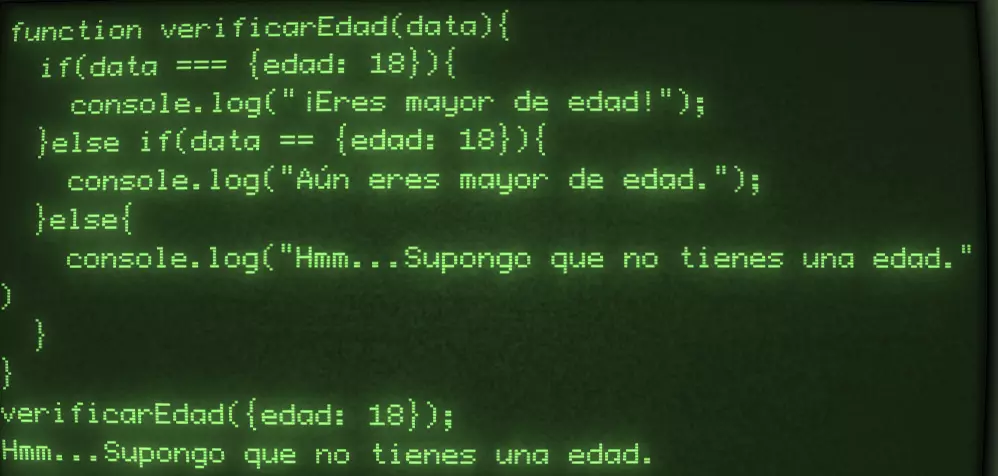

</p></details>
</div>

---

# 19. ¿Qué devuelve esta función?
###### [ÍNDICE](https://bit.ly/44AIBmF)

```javascript
function obtenLaEdad(...args){
  console.log(typeof args);
}
obtenLaEdad(27);
```
- A. `number`
- B. `array`
- C. `object`
- D. `NaN`

<div align="center">

<details><summary><b>RESPUESTA</b></summary> <p>

## La correcta es la `C`.

<div align="left">

El [operador de propagación (spread operator)
(...)](https://rebrand.ly/u3lsrme)
se utiliza para convertir los argumentos de una función en un array. Al usar el
operador spread, los argumentos se colocan dentro de corchetes [], lo que crea
un nuevo array con esos elementos.

Dado que un array es un tipo de objeto en JavaScript, el operador typeof 
devuelve `"object"` cuando se aplica a un array. Esto se debe a que, desde el 
punto de vista de JavaScript, un array es un objeto especializado que contiene 
una colección ordenada de elementos.

En resumen, el operador de propagación ( `...` ) se utiliza para convertir los 
argumentos en un array, y `typeof args` devolverá "object" debido a que un array 
es considerado un tipo especial de objeto en JavaScript.

</div>

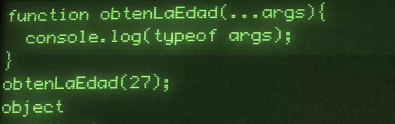

</p></details>

</div>

---

# 20. ¿Qué devuelve esta función?
###### [ÍNDICE](https://bit.ly/44AIBmF)

```javascript
function obtenerEdad(){
  "use strict";
  edad = 27;
  console.log(edad);
}

obtenerEdad();
```
- A. `27`
- B. `undefined`
- C. `ReferenceError`
- D. `TypeError`

<div align="center">

<details><summary><b>RESPUESTA</b></summary> <p>

## La correcta es la C.

<div align="left">

Al utilizar `"use strict"`, se garantiza que no se declaren variables globales 
de manera accidental. En este caso, no declaramos la variable `edad`, y debido a
la inclusión de `"use strict"`, se generará un error de referencia. Si no 
hubiéramos utilizado `"use strict"`, la operación habría funcionado 
correctamente, ya que la propiedad `edad` se habría agregado al objeto global.

</div>

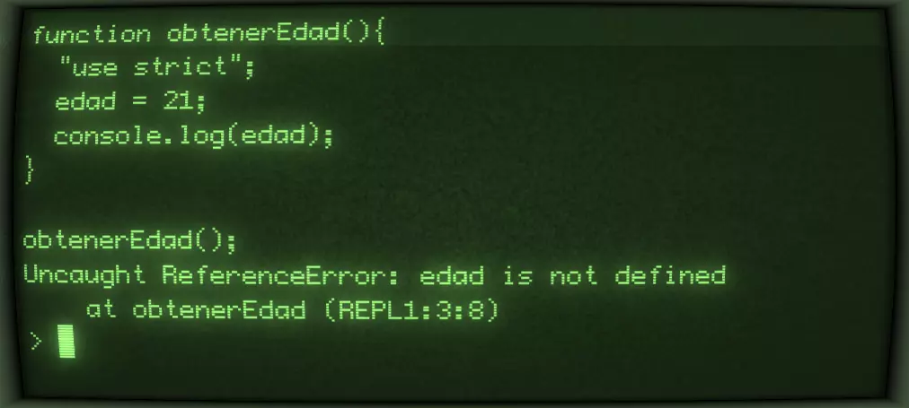
</p></details>

</div>

---
<!-- 21 a 30 -->
# 21. ¿Cuál es el valor de `suma`?
###### [ÍNDICE](https://bit.ly/44AIBmF)

```javascript
const suma = eval("10*10+5");
```
- A. `105`
- B. `"105"`
- C. `TypeError`
- D. `"10*10+5"`

<div align="center">

<details><summary><b>RESPUESTA</b></summary> <p>

## La correcta es la A.

<div align="left">

El código proporcionado declara una constante llamada `"sum"` y le asigna el 
resultado de evaluar la expresión `"10*10+5"`. La evaluación de esta expresión 
resulta en el número `105`.

La función `eval()` se utiliza para evaluar códigos proporcionados como una 
cadena. En este caso, la cadena contiene una expresión aritmética que se evalúa 
y devuelve el resultado numérico.

</div>


</p></details>

</div>

---

# 22. ¿Por cuánto tiempo accesible `sabroso_secreto`?
###### [ÍNDICE](https://bit.ly/44AIBmF)

```javascript
sessionStorage.setItem("sabroso_secreto", 123);
```
- A. `Para siempre, los datos no se pierden.`
- B. `Cuando el usuario cierra todo el navegador, no sólo la pestaña.`
- C. `Cuando el usuario cierra la pestaña.`
- D. `Cuando el usuario apaga la computadora.`

<div align="center">

<details><summary><b>RESPUESTA</b></summary> <p>

## La correcta es la `C`.

<div align="left">

Los datos que se guardan en `sessionStorage` se eliminan al cerrar la pestaña 
del navegador.

De haberse usado `localStorage`, los datos habrían estado allí siempre, a menos
que se invoque `localStorage.clear()`.

</div>

</p></details>

</div>

---

# 23. ¿Qué imprime `console.log( )`?
###### [ÍNDICE](https://bit.ly/44AIBmF)

```javascript
var numero = 5;
var numero = 15;
console.log(numero);
```
- A. `5`
- B. `15`
- C. `SyntaxError`
- D. `ReferenceError`

<div align="center">

<details><summary><b>RESPUESTA</b></summary> <p>

## La correcta es la B.

<div align="left">

Mediante la palabra reservada `var` se puden declarar múltiples variables con el 
mismo nombre. Pero tomará el último valor que le asigne.

No sucede lo mismo con `let` y `const` porque tienen un alcance de bloque.

</div>


</p></details>

</div>

---

# 24. ¿Qué devuelve esta función?
###### [ÍNDICE](https://bit.ly/44AIBmF)

```javascript
const objeto = {
		1: "a",
		2: "b", 
		3: "c" 
	  };
const conjunto = new Set([1, 2, 3, 4, 5]);

objeto.hasOwnProperty("1");
objeto.hasOwnProperty(1);
conjunto.has("1");
conjunto.has(1);
```
- A. `false` `true` `false` `true`
- B. `false` `true` `true` `true`
- C. `true` `true` `false` `true`
- D. `true` `true` `true` `true`

<div align="center">

<details><summary><b>RESPUESTA</b></summary> <p>

## La correcta es la C.

<div align="left">

Todas las claves de un objeto (excepto las que utilizan símbolos como 
clave) actúan como cadenas, incluso si no son escritas como una cadena.
Es por eso que `obj.hasOwnProperty("1")` también devuelve verdadero.

En cambio en el caso de un conjunto no funciona así. Como no hay un "1"
en nuestro set, `set.has("1")` devuelve `falso`. Tiene el tipo numérico
`1`, `set.has(1)` devuelve `true`.

</div>

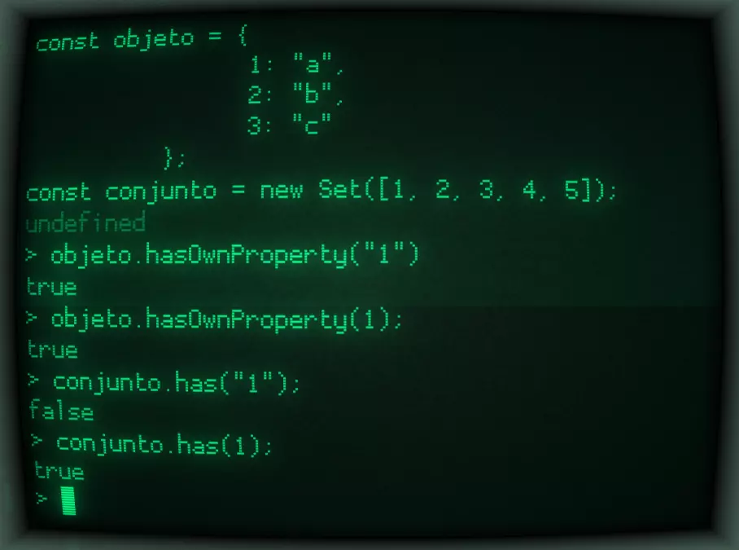
</p></details>

</div>

---

# 25. ¿Qué devuelve esta función?
###### [ÍNDICE](https://bit.ly/44AIBmF)

```javascript
const objeto = { a: "uno", b: "dos", a: "tres" };
console.log(objeto);
```
- A. `{ a: "uno", b: "dos"}`
- B. `{ b: "dos", a: "tres"}`
- C. `{ a: "tres", b: "dos"}`
- D. `SyntaxError`

<div align="center">

<details><summary><b>RESPUESTA</b></summary> <p>

## La correcta es la C.

<div align="left">

Si el objeto tiene dos claves con el mismo nombre, la clave será 
reemplazada. Su posición seguirá siendo la primera, pero con el valor
actualizado al último especeficado.

</div>

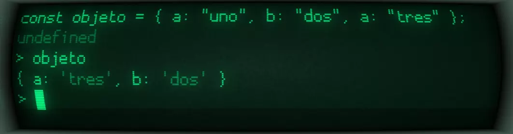
</p></details>

</div>

---

# 26. El contexto de ejecución de JavaScript crea dos cosas: el objeto global y la palabra reservada `"this"`.

###### [ÍNDICE](https://bit.ly/44AIBmF)

- A. `Verdadero` 
- B. `Falso`
- C. `Depende`

<div align="center">

<details><summary><b>RESPUESTA</b></summary> <p>

## La correcta es la `A`.

<div align="left">

En el contexto de ejecución de JavaScript, se crean dos cosas: el objeto global 
y la palabra reservada `"this"`. Por lo tanto, la respuesta correcta es `A`: 
Verdadero. El contexto de ejecución global es accesible en todo el código y 
proporciona acceso al objeto global (como `window` en un navegador o `global` 
en Node.js) y a la palabra reservada `"this"`.

</div>

</p></details>

</div>

---

# 27. ¿Qué imprime este bucle?
###### [ÍNDICE](https://bit.ly/44AIBmF)

```javascript
for(let i = 1; i < 5; i++){
  if (i === 3) continue;
  console.log(i);
}
```
- A. `1` `2`
- B. `1` `2` `3`
- C. `1` `2` `4`
- D. `1` `3` `4`

<div align="center">

<details><summary><b>RESPUESTA</b></summary> <p>

## La correcta es la C.

<div align="left">

La palabra reservada `continue` omite una iteración si una cierta condición, en 
este caso `(i === 3)`, retorna `verdadero`.

</div>

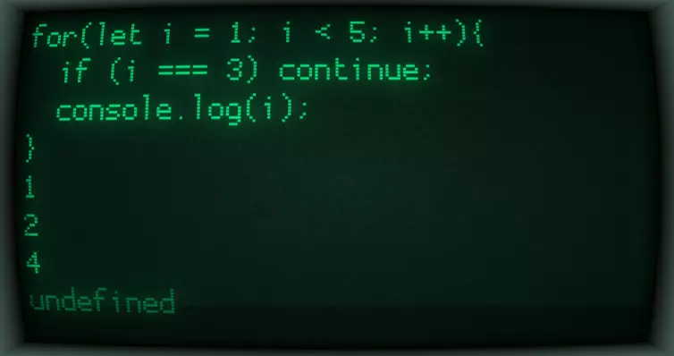
</p></details>

</div>

---

# 28. ¿Qué se imprime en la consola?
###### [ÍNDICE](https://bit.ly/44AIBmF)

```javascript
String.prototype.darleUnHeladoAFulano = () => {
  return "¡Denle un helado a Fulano!"
}
const nombre = "Fulano";
console.log(nombre.darleUnHeladoAFulano())
```
- A. `"¡Denle un helado a Fulano!"`
- B. `TypeError: not a function`
- C. `SyntaxError`
- D. `undefined`

<div align="center">

<details><summary><b>RESPUESTA</b></summary> <p>

## La correcta es la C.

<div align="left">

`String` es un constructor que viene incorporado en JavaScript, al que podemos 
añadir propiedades. En este caso concreto, añadimos un método a su prototipo.
Las cadenas primitivas se convierten automáticamente en un objeto de cadena, 
generado por la función de prototipo de cadena. Por lo tanto, todas las cadenas
(objetos de cadenas) tienen acceso a ese método.

</div>

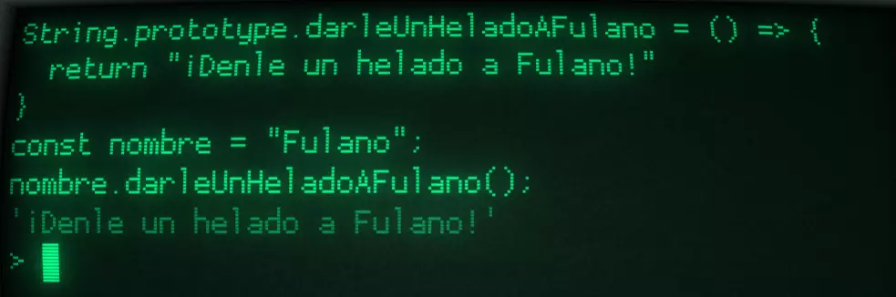
</p></details>

</div>

---

# 29. ¿Qué se imprime en la consola?
###### [ÍNDICE](https://bit.ly/44AIBmF)

```javascript
const a = {};
const b = { clave: 'b' };
const c = { clave: 'c' };

a[b] = 123;
a[c] = 456;

console.log(a[b]);
```
- A. `123`
- B. `456`
- C. `undefined`
- D. `ReferenceError`

<div align="center">

<details><summary><b>RESPUESTA</b></summary> <p>

## La correcta es la B.

<div align="left">

Las claves de los objetos se convierten automáticamente en cadenas. Aquí estamos
tratando de establecer un objeto como clave del objeto `'a'`,
con el valor de `123`.

Sin embargo, cuando convertimos un objeto a cadena, se convierte en 
`"[object Object]"`. Así que lo que estamos haciendo aquí es lo siguiente:
`a["[object Object]"] = 123`. Luego, intentamos hacer lo mismo nuevamente. 
`'c'` es otro objeto que se convierte implícitamente en una cadena. Entonces, 
`a["[object Object]"] = 456`.

Luego, registramos en la consola a[b], que es en realidad a["[object Object]"]. 
Acabamos de establecer ese valor en 456, por lo que devuelve 456.

</div>


</p></details>

</div>

---

# 30. ¿Qué se imprime en la consola?
###### [ÍNDICE](https://bit.ly/44AIBmF)

```javascript
const foo = () => console.log("Primero");
const bar = () => setTimeout(() => console.log("Segundo"));
const baz = () => console.log("Tercero");

bar();
foo();
baz();
```
- A. `Primero` `Segundo` `Tercero`
- B. `Primero` `Tercero` `Segundo`
- C. `Segundo` `Primero` `Tercero`
- D. `Segundo` `Tercero` `Primero`

<div align="center">

<details><summary><b>RESPUESTA</b></summary> <p>

## La correcta es la `B`.

<div align="left">

A pesar de que invocamos la función setTimeout primero, su mensaje se registró 
al final.

Esto se debe a que en los navegadores no solo tenemos el motor de tiempo de 
ejecución, sino también algo llamado WebAPI. El WebAPI nos proporciona la 
función setTimeout para empezar, así como otras funcionalidades como el DOM.

Después de que el callback de setTimeout se agrega al WebAPI, la propia función 
setTimeout (pero no el callback) se saca de la pila de ejecución. 
Ahora, se invoca foo, y se imprime "Primero". Luego foo se saca de la pila y 
se invoca baz, imprimiendo "Tercero". baz se saca de la pila.

Aquí es donde comienza a funcionar el bucle de eventos (event loop). El bucle de
eventos revisa la pila de ejecución y la cola de tareas. Si la pila está vacía, 
toma el primer elemento de la cola de tareas y lo coloca en la pila. Se invoca 
bar, se imprime "Segundo" y luego se saca de la pila.

</div>


</p></details>

</div>

---

# 31. ¿Cuál de estos valores de evalúa FALSE?
###### [ÍNDICE](https://bit.ly/44AIBmF)

```javascript
0;
new Number(0);
("");
(" ");
new Boolean(false);
undefined;
```
- A. `0`, `""`, `undefined`
- B. `0`, `new Number(0)`, `""`, `new Boolean(false)`, `undefined`
- C. `0`, `""`, `new Boolean(false)`, `undefined`
- D. `Todas las de arriba`

<div align="center">

<details><summary><b>RESPUESTA</b></summary> <p>

## La correcta es la `A`.

<div align="left">

Los [valores falsos](https://shorturl.at/tyzSZ) son aquellos que se evalúan como 
FALSE. 
En JavaScript hay 6:
- `undefined`
- `null`
- `NaN`
- `0`
- `""` (cadena vacía)
- `false`


</div>


</p></details>

</div>

---

# 32. ¿Qué se imprime en la consola?
###### [ÍNDICE](https://bit.ly/44AIBmF)

```javascript
console.log(typeof typeof 1);
```
- A. `"number"`
- B. `"string"`
- C. `"object"`
- D. `"undefined"`

<div align="center">

<details><summary><b>RESPUESTA</b></summary> <p>

## La correcta es la `B`.

<div align="left">

`typeof 1` devuelve `"number"` 
y 
`typeof "number"` devuelve `"string"`.

</div>

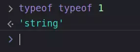
</p></details>

</div>

---

# 33. ¿Qué se imprime en la consola?
###### [ÍNDICE](https://bit.ly/44AIBmF)

```javascript
const numeros = [1, 2, 3];
numeros[10] = 11;
console.log(numeros);
```
- A. `[1, 2, 3, 7 x null, 11]`
- B. `[1, 2, 3, 11]`
- C. `[1, 2, 3, 7 x empty, 11]`
- D. `SyntaxError`

<div align="center">

<details><summary><b>RESPUESTA</b></summary> <p>

## La correcta es la `C`.

<div align="left">

Cuando queremos agregar un valor dentro de un arreglo, en una posición que 
excede la longitud del mismo, JavaScript emplea algo llamado "ranuras vacías". 
Estas posiciones vacías, en realidad tienen el valor de `undefined`.
El modo en que se visualizan estas posiciones vacías varía según el dónde se 
ejecute el código (navegador, node, etc.).

</div>

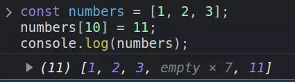
</p></details>

</div>

---

# 34. ¿Qué devuelve esta función?
###### [ÍNDICE](https://bit.ly/44AIBmF)

```javascript
[[0, 1], [2, 3]].reduce(
  (acc, cur) => {
    return acc.concat(cur);
  },
  [1, 2]
);
```
- A. `[0, 1, 2, 3, 1, 2]`
- B. `[6, 1, 2]`
- C. `[1, 2, 0, 1, 2, 3]`
- D. `[1, 2, 6]`

<div align="center">

<details><summary><b>RESPUESTA</b></summary> <p>

## La correcta es la `C`.

<div align="left">

Esta es una operación de reducción utilizando el método `reduce()` en un array
de arrays. La función `reduce()` se utiliza para combinar los elementos de un
array en un único valor, aplicando una función acumuladora de izquierda a
derecha.

La operación de reducción se realiza de la siguiente manera:

El valor inicial `(seed)` para la acumulación es `[1, 2]`. En cada iteración, la
función acumuladora toma dos argumentos: el acumulador `(acc)` y el valor actual
`(cur)`.La función acumuladora concatena los elementos del array actual `(cur)`
al acumulador `(acc)`. Al finalizar las iteraciones, el resultado final es el
acumulador modificado con los elementos concatenados. Aquí está la explicación
paso a paso:

*Paso 1:*

acc = `[1, 2]`
cur = `[0, 1]`
Resultado de concatenación: `[1, 2, 0, 1]`

*Paso 2:*

acc = `[1, 2, 0, 1]`
cur = `[2, 3]`
Resultado de concatenación: `[1, 2, 0, 1, 2, 3]`
El resultado final de la operación `reduce()` es `[1, 2, 0, 1, 2, 3]`.

</div>

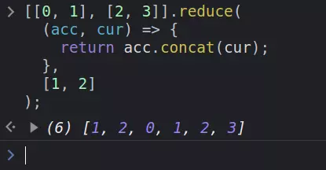
</p></details>

</div>

---

# 35. ¿A qué valores booleanos se resuelven?
###### [ÍNDICE](https://bit.ly/44AIBmF)

```javascript
!!null;
!!"";
!!1;
```
- A. `false` `true` `false`
- B. `false` `false` `true`
- C. `false` `true` `true`
- D. `true` `true` `false`

<div align="center">

<details><summary><b>RESPUESTA</b></summary> <p>

## La correcta es la `B`.

<div align="left">

`null` es falso. `! null` devuelve `true`. `! true` devuelve `false`.

`""` es false. `! ""` devuelve `true`. `! ""` devuelve `false`.

`1` es verdadero. `! 1` devuelve `false`. `! false` devuelve `true`.

</div>

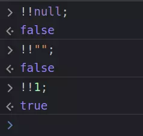
</p></details>

</div>

---

# 36. ¿Qué devuelve el siguiente código?
###### [ÍNDICE](https://bit.ly/44AIBmF)

```javascript
[..."Franco"];
```
- A. `["F", "r", "a", "n", "c", "o"]`
- B. `"Franco"`
- C. `[[],"Franco"]`
- D. `[["F", "r", "a", "n", "c", "o"]]`

<div align="center">

<details><summary><b>RESPUESTA</b></summary> <p>

## La correcta es la `A`.

<div align="left">

Una cadena es un elemento iterable. La [`sintaxis extendida o spread sintax`
](https://shorturl.at/rDES6)
permite a un elemento iterable ser expandido en lugares donde cero o más
elementos (para [`Array literales`](https://shorturl.at/jpCSZ)) son esperados.

</div>

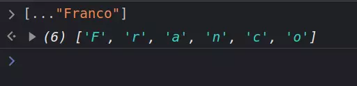
</p></details>

</div>

---

# 37. ¿Qué devuelve el siguiente código?
###### [ÍNDICE](https://bit.ly/44AIBmF)

```javascript
let persona = {nombre: "Franco"}
const miembros = [persona]
persona = null;

console.log(miembros)
```
- A. `null`
- B. `[null]`
- C. `[{nombre: "Franco"}]`
- D. `[{}]`

<div align="center">

<details><summary><b>RESPUESTA</b></summary> <p>

## La correcta es la `C`.

<div align="left">

Primero, creamos una variable llamada `"persona"` y le asignamos un objeto con
una propiedad "`nombre`".

Luego, declaramos una variable llamada `"miembros"` y la inicializamos como un
array. Asignamos el primer elemento de ese array con el valor de la variable
`"persona"`.

Es importante destacar que en JavaScript, los objetos se pasan por referencia,
lo que significa que cuando asignamos un objeto a otra variable, ambas variables
apuntan al mismo objeto en memoria. Al hacer esto, no se crea una copia
independiente del objeto, sino que se copia la referencia a ese objeto.

A continuación, establecemos que la variable `"persona"` sea igual a "null".
Esto solo afecta a la variable `"persona"`, pero no altera el primer elemento
del array `"miembros"`. Esto se debe a que el primer elemento del array tiene
una referencia independiente (copiada) al objeto original. Por lo tanto, aunque
`"persona"` se haya establecido como "null", el primer elemento en `"miembros"`
sigue manteniendo su referencia hacia el objeto original.

En resumen, la modificación de la variable `"persona"` no afecta al primer
elemento del array "`miembros`", ya que este último mantiene su referencia al
objeto original. Cuando mostramos el contenido del array "`miembros`" por
consola, el primer elemento aún contiene el valor del objeto, el cual se
mostrará en la consola.

</div>


</p></details>

</div>

---

# 38. ¿Cuál es el resultado?
###### [ÍNDICE](https://bit.ly/44AIBmF)

```javascript

console.log(5 + 7 + "10");

```
- A. `"5710"`
- B. `"1210"`
- C. `22`
- D. `"22"`

<div align="center">

<details><summary><b>RESPUESTA</b></summary> <p>

## La correcta es la `B`.

<div align="left">

La asociatividad de operadores determina el orden en el que el compilador evalúa
las expresiones que contienen operadores. Este orden puede ser de izquierda a 
derecha o de derecha a izquierda, dependiendo de la configuración de los 
operadores y su precedencia.

En nuestro caso, solo contamos con un tipo de operador, que es la suma 
representada por el símbolo "+". Para la suma, la asociatividad es de 
izquierda a derecha, lo que significa que se evalúan primero los operandos 
situados más a la izquierda y luego los de la derecha.

`5 + 7` se evalúa primero, dando el número `12`.

`12 + "10"` da `"1210"` por la coerción. JavaScript convierte el número `12` a 
string.

</div>

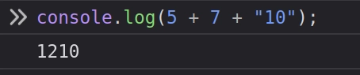
</p></details>

</div>

---

# 39. ¿Cuál es el valor de `numero`?
###### [ÍNDICE](https://bit.ly/44AIBmF)

```javascript

const numero = parseInt("4*2", 10);

```
- A. `8`
- B. `"8"`
- C. `4`
- D. `NaN`

<div align="center">

<details><summary><b>RESPUESTA</b></summary> <p>

## La correcta es la `C`.

<div align="left">

El método `parseInt` recibe dos argumentos, el segundo corresponde a la base a 
la cual queremos transformar el primer argumento, si los caracteres del string 
son válidos. Una vez encuetra un caracter que no es un número válido en la base 
seleccionada, deja de recorrer el string e ignora los siguientes caracteres.

`*` no es un número válido. Solo convierte "4" el decimal `4`. Por eso la 
variable `numero` tiene el valor `4`.

</div>

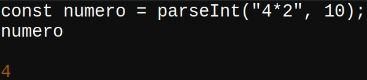
</p></details>

</div>

---
# 40. ¿Qué queda guardado en la variable `data`?
###### [ÍNDICE](https://bit.ly/44AIBmF)

```javascript

const settings = {
     username: "paco82",
     level: 59,
     health: 85
};

const data = JSON.stringify(settings, ["level", "health"]);
console.log(data);

```
- A. `"{"level":59, "health":85}"`
- B. `"{"username": "paco82"}"`
- C. `"["level", "health"]"`
- D. `"{"username":"paco82", "level":59, "health":85}"`

<div align="center">

<details><summary><b>RESPUESTA</b></summary> <p>

## La correcta es la `A`.

<div align="left">

El segundo argumento de JSON.stringify es el reemplazador (replacer). El 
reemplazador puede ser una función o un arreglo, y te permite tener control 
sobre qué propiedades se convertirán en cadenas de texto y cómo se realizará 
dicha conversión.

Si utilizas un arreglo como reemplazador, solo las propiedades cuyos nombres 
estén incluidos en el arreglo serán agregadas al string JSON resultante. En 
este caso, únicamente las propiedades con nombres "level" y "health" serán 
incluidas, mientras que la propiedad "username" será excluida. Por lo tanto, la 
variable 'data' quedaría como sigue: `{"level": 59, "health": 85}`.

Por otro lado, si optas por utilizar una función como reemplazador, esta será 
llamada por cada propiedad del objeto mientras se convierte a una cadena de 
texto. El valor retornado por esta función será el valor que tomará la propiedad
cuando sea añadida al string JSON. Si la función devuelve undefined, la 
propiedad será excluida del string JSON.

Es importante tener en cuenta estas opciones al utilizar JSON.stringify para 
personalizar la serialización de objetos en formato JSON.

</div>

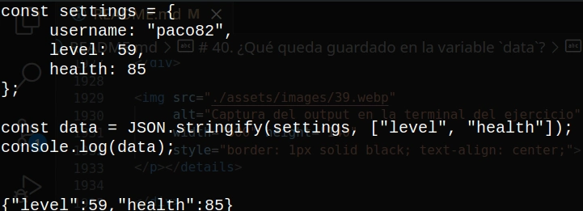
</p></details>

</div>

---

# 41. ¿Qué sucede en este caso?
###### [ÍNDICE](https://bit.ly/44AIBmF)

```javascript
// contador.js
let contador = 10;
export default contador;

// index.js
import miContador from "./contador.js";

miContador += 1;

console.log(miContador)

```
- A. `10`
- B. `11`
- C. `Error`
- D. `NaN`

<div align="center">

<details><summary><b>RESPUESTA</b></summary> <p>

## La correcta es la `C`.

<div align="left">

En el código proporcionado, hay dos archivos: `contador.js` y `index.js`.

En `contador.js`, se ha declarado una variable llamada `contador` con un valor
inicial de 10 utilizando la palabra clave `let`. Luego, esta variable se exporta
como un valor por defecto utilizando `export default contador;`.

En `index.js`, se importa el valor exportado `miContador` desde `contador.js`.
Sin embargo, en el intento de modificar `miContador` aumentando su valor en 1
(`miContador += 1;`), se produce un error durante la ejecución. Esto se debe a
que `miContador` se importa como una variable de solo lectura, y no se puede
modificar directamente.

Debido a esta operación inválida, se generará un error en tiempo de ejecución y
se mostrará en la consola. 

</div>
</p></details>
</div>

---

# 42. ¿Qué sucede en este caso?
###### [ÍNDICE](https://bit.ly/44AIBmF)

```javascript
const nombre = "Franco";

edad = 27;

console.log(delete nombre);
console.log(delete edad);

```
- A. `false, true`
- B. `"Franco", 27`
- C. `true, true`
- D. `undefined, undefined`

<div align="center">

<details><summary><b>RESPUESTA</b></summary> <p>

## La correcta es la `A`.

<div align="left">

El operador "delete" arroja un valor booleano: devuelve "true" si la eliminación
tiene éxito, mientras que devuelve "false" si no. No obstante, es esencial tener
en cuenta que no es posible emplear el operador "delete" para eliminar variables
que han sido declaradas utilizando "var", "const" o "let".

Dentro de este contexto, consideremos la variable "nombre" que ha sido declarada
utilizando "const". Debido a esta declaración, no es posible eliminarla con
éxito y, por lo tanto, el operador "delete" devuelve "false" en este caso. Por
otro lado, cuando asignamos el valor 27 a la variable "edad", en realidad
estamos añadiendo una propiedad llamada "edad" al objeto global. Es importante
destacar que es posible eliminar propiedades de objetos de esta manera, tanto de
objetos generales como del objeto global. Por lo tanto, al utilizar "delete
edad", obtenemos un valor de "true", indicando una eliminación exitosa.

</div>

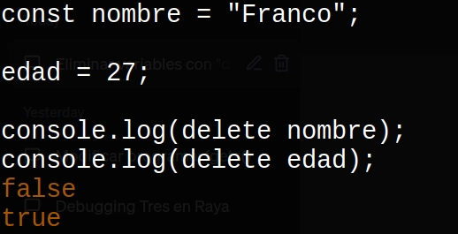
</p></details>

</div>

---

# 43. ¿Cuál es el resultado?
###### [ÍNDICE](https://bit.ly/44AIBmF)

```javascript
const numeros = [75, 15, 28, 83, 71];
const [F] = numeros;

console.log(F);

```
- A. `[[75, 15, 28, 83, 71]]`
- B. `[75, 15, 28, 83, 71]`
- C. `75`
- D. `[75]`

<div align="center">

<details><summary><b>RESPUESTA</b></summary> <p>

## La correcta es la `C`.

<div align="left">

Imagina que podemos extraer los valores almacenados en arrays o propiedades de
objetos utilizando la técnica de desestructuración. Veamos un ejemplo:

```js
[a, b] = [1, 2];
```

Después de esta asignación, "a" contendrá el valor 1 y "b" contendrá el valor 2.
Otro truco interesante es el siguiente:

```js
[F] = [75, 15, 28, 83, 71];
```

Este código nos indica que "y" tomará el valor del primer elemento en el array,
en este caso, el número 75. Al inspeccionar el valor de "y" en la consola,
obtendremos como resultado 75. ¡Así de sencillo es este proceso!

</div>

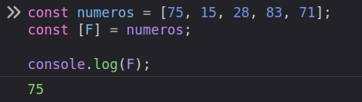
</p></details>

</div>

---

# 44. ¿Cuál es el resultado?
###### [ÍNDICE](https://bit.ly/44AIBmF)

```javascript
let num = 50;

const incrementarNumero = () => num++;
const incrementarNumeroPasado = numero => numero++;

const num1 = incrementarNumero();
const num2 = incrementarNumeroPasado(num1);

console.log(num1);
console.log(num2);

```
- A. `50`, `50`
- B. `50`, `51`
- C. `51`, `51`
- D. `51`, `52`

<div align="center">

<details><summary><b>RESPUESTA</b></summary> <p>

## La correcta es la `A`.

<div align="left">

Se inicializa una variable llamada num con el valor 50.

La función incrementarNumero es definida como una función de flecha (() =>).
Cuando esta función se llama, primero devuelve el valor actual de num (que es
50), y luego incrementa num en 1.

La función incrementarNumeroPasado toma un parámetro llamado numero. Cuando esta
función se llama, devuelve el valor de numero (sin cambiarlo) y luego intenta
incrementar el valor de numero, pero este incremento no afecta a num1 o num2.

Se crea una variable num1 y se le asigna el resultado de llamar a la función
incrementarNumero. En este punto, num1 obtiene el valor inicial de num (50) y
luego num se incrementa en 1.

Se crea una variable num2 y se le asigna el resultado de llamar a la función
incrementarNumeroPasado con num1 como argumento. Como mencioné antes, esta
función devuelve el valor de num1 (que es 50) y luego intenta incrementar el
valor, pero nuevamente, este incremento no afecta a num2.

Finalmente, se muestra en la consola el valor de num1 y num2. Como resultado,
verás que num1 es 50 (ya que es el valor original de num), y num2 también es 50
(ya que es el valor que obtiene de num1).
</div>

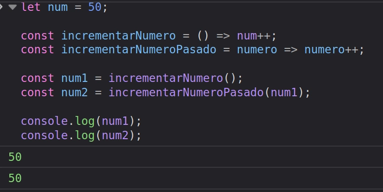
</p></details>

</div>

---

# 45. ¿Qué se imprime en la consola?
###### [ÍNDICE](https://bit.ly/44AIBmF)

```javascript
const valor = { numero: 25};

const multiplicar = (x = {...valor}) => {
     console.log((x.numero *= 2));
};

multiplicar();
multiplicar();
multiplicar(valor);
multiplicar(valor);

```
- A. `50`, `100`, `200`, `400`
- B. `50`, `100`, `50`, `100`
- C. `50`, `50`, `50`, `100`
- D. `NaN`, `NaN`, `50`, `100`

<div align="center">

<details><summary><b>RESPUESTA</b></summary> <p>

## La correcta es la `A`.

<div align="left">

En ES6, se nos permite establecer valores predeterminados para los parámetros.
Si no se proporciona un valor distinto al llamar a la función, o si el valor del
parámetro es "undefined", este tomará el valor predeterminado. En este caso,
estamos extendiendo las características del objeto "valor" hacia un objeto
nuevo, de manera que "x" adquiere el valor por defecto de { número: 25 }.

Es importante mencionar que ¡el argumento predeterminado se evalúa en el momento
de la llamada! Cada vez que invocamos la función, se crea un objeto nuevo. Las
dos primeras veces que llamamos a la función "multiplicar" sin proporcionar un
valor, "x" toma el valor predeterminado de { número: 25 }. Luego, mostramos el
resultado de multiplicar este número en la consola, lo que nos da 50.

En la tercera ocasión en que llamamos a "multiplicar", pasamos un argumento: el
objeto denominado "valor". El operador "*=" es básicamente una forma abreviada
de escribir "x.numero = x.numero * 2": estamos modificando el valor de
"x.numero" y mostrando en la consola el resultado de multiplicarlo por 2.

En el cuarto caso, volvemos a pasar el objeto "valor". Dado que "x.numero" había
sido previamente modificado a 50, la expresión "x.numero *= 2" nos devuelve 100.

</div>

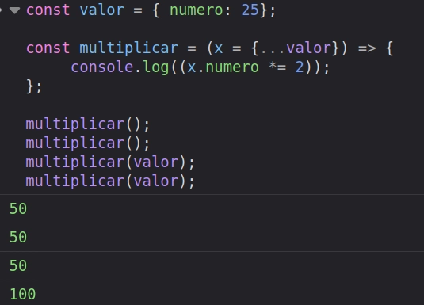
</p></details>

</div>

---
# 46. ¿Qué se imprime en la consola?
###### [ÍNDICE](https://bit.ly/44AIBmF)

```javascript

console.log(Number(2) === Number(2))
console.log(Boolean(false) === Boolean(false))
console.log(Symbol('foo') === Symbol('foo'))

```
- A. `true`, `true`, `false`
- B. `false`, `true`, `false`
- C. `true`, `false`, `true`
- D. `true`, `true`, `true`

<div align="center">

<details><summary><b>RESPUESTA</b></summary> <p>

## La correcta es la `A`.

<div align="left">

Cada Symbol es totalmente especial y único. Cuando le pasas una descripción como
argumento a la función Symbol, es solo para identificarlo. El valor real del
Symbol no está ligado a ese argumento. Debido a esta característica, cuando los
comparamos, como en el caso de crear dos Symbols usando Symbol('foo'), obtenemos
dos Symbols completamente distintos. Así que, aunque parezcan similares,
Symbol('foo') y Symbol('foo') son únicos y no son iguales; de hecho,
Symbol('foo') === Symbol('foo') arroja false.

</div>

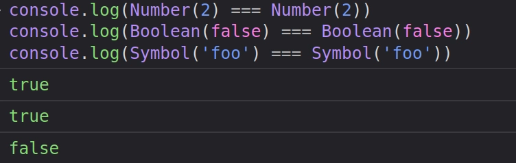
</p></details>

</div>

---

# 47. ¿Qué se imprime en la consola?
###### [ÍNDICE](https://bit.ly/44AIBmF)

```javascript
const nombre = "Franco Ibañez";
console.log(nombre.padStart(15,"*"));
console.log(nombre.padStart(3,"*"));

```

- A. `"Franco Ibañez"`, `"Franco Ibañez"`
- B. `"***************Franco Ibañez"`, `"***Franco Ibañez"`
- C. `"**Franco Ibañez"`, `"Franco Ibañez"`
- D. `"**Franco Ibañez"`, `"***"`

<div align="center">

<details><summary><b>RESPUESTA</b></summary> <p>

## La correcta es la `C`.

<div align="left">

[Artículo mdn web docs sobre  el método padStart().](https://shorturl.at/aLWY7)

El método padStart en JavaScript es una herramienta útil para manipular cadenas
de texto. Permite agregar caracteres específicos al principio de una cadena
hasta alcanzar una longitud deseada. Veamos cómo funciona con un ejemplo:

```javascript

const nombre = "Franco Ibañez";

// Rellenar al principio con asteriscos hasta tener 15 caracteres
console.log(nombre.padStart(15, "*")); // Resultado: "**Franco Ibañez"

// Rellenar al principio con asteriscos hasta tener 3 caracteres
console.log(nombre.padStart(3, "*")); // Resultado: "Franco Ibañez"

```

En el primer caso, hemos especificado que la cadena debe tener una longitud de
15 caracteres y, si es necesario, se rellenará con asteriscos al principio. En
el segundo caso, hemos especificado una longitud mínima de 3 caracteres, pero
como la cadena original ya es más larga, no se realiza ningún cambio.

El método padStart puede ser útil en diversas situaciones, como formatear
cadenas para su presentación o alinear texto en tablas. ¡Es una herramienta
versátil que puedes incorporar a tus proyectos de programación!

</div>

</p></details>

</div>

---

# 48. ¿Qué se imprime en la consola?
###### [ÍNDICE](https://bit.ly/44AIBmF)

```javascript
function agregarALaLista(elemento, lista){
     return lista.push(elemento);
}

const resultado = agregarALaLista("naranja", ["mandarina"]);
console.log(resultado);

```

- A. `["naranja", "mandarina"]`
- B. `2`
- C. `true`
- D. `undefined`

<div align="center">

<details><summary><b>RESPUESTA</b></summary> <p>

## La correcta es la `B`.

<div align="left">

Tenemos una función llamada `agregarALaLista` que toma dos parámetros:
`elemento` y `lista`. La función intenta agregar el `elemento` a la `lista`
utilizando el método `push()` que tienen los arrays en JavaScript.


La función `agregarALaLista` se llama con los argumentos `"naranja"` y
`["mandarina"]`. Esto significa que estamos tratando de agregar `"naranja"` a la
lista que inicialmente contiene solo `"mandarina"`.

Cuando utilizamos `push()` para agregar un `elemento` a un array en JavaScript,
este método no devuelve el array modificado. En cambio, devuelve la longitud
actual del array después de agregar el `elemento`.

Dado que hemos agregado `"naranja"` a la lista que tenía un `elemento`, la
longitud del array resultante será 2. Por lo tanto, la función `agregarALaLista`
devuelve 2.

Por lo tanto, la opción correcta es `B: 2`, ya que es el valor que se asigna a
la variable resultado y se imprime en la consola.

</div>

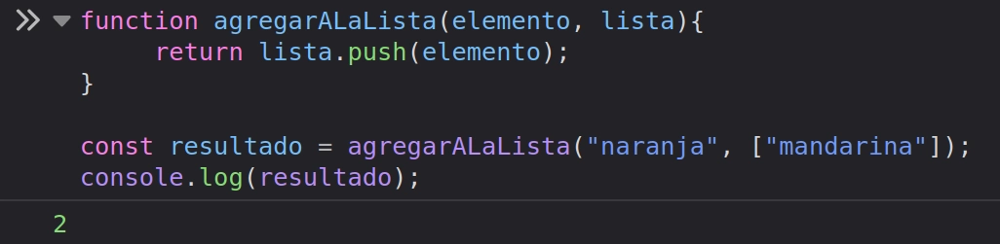
</p></details>

</div>

---

# 49. ¿Qué se imprime en la consola?
###### [ÍNDICE](https://bit.ly/44AIBmF)

```javascript
console.log(String.raw`Hello\nworld`);

```

- A. `Hello world!`

- B. `Hello`<br>
     &nbsp;&nbsp;&nbsp;&nbsp;&nbsp;`world`

- C. `Hello\nworld`

- D. `Hello\n`<br>
     &nbsp;&nbsp;&nbsp;&nbsp;&nbsp;`world`

<div align="center">

<details><summary><b>RESPUESTA</b></summary> <p>

## La correcta es la `C`.

<div align="left">

La función String.raw devuelve una cadena en la que se ignoran los escapes (\n,
 \v, \t, etc.). Las barras invertidas pueden ser un problema, ya que podrías
 terminar con algo como:

```javascript
const path = `C:\Documents\Projects\table.html`
```

Lo que resultaría en:

```javascript
"C:DocumentsProjects able.html"
```

Con String.raw, simplemente ignoraría el escape y mostraría:

```javascript
C:\Documents\Projects\table.html
```

En este caso, la cadena es "Hello\nworld", que se registra tal cual.

</div>

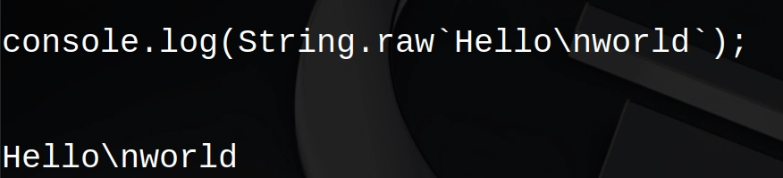
</p></details>

</div>

---